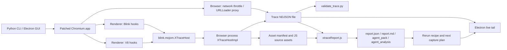

# XTrace 当前项目技术方案

## 1. 项目定位

XTrace 是一个面向 macOS 的 Chromium 原生运行时追踪工具，用于授权场景下的指纹研究、反混淆分析、业务 API 请求链路观察和防御性 JavaScript 分析。

项目的核心方向不是页面内 JavaScript hook，而是修改 Chromium/Blink/V8 原生代码，在浏览器真实执行路径中采集事件，再由本地工作台生成可复查的 NDJSON、资产、报告和复跑建议。

当前技术目标：

- 保持 Chromium renderer sandbox 开启，避免 renderer 直接写本地文件。
- 在 Blink/V8/Browser network 层采集指纹 API、反分析 API、VMP runtime hook、网络请求与响应事件。
- 输出 schema v1 NDJSON，支持本地 validator、GUI live tail、报告生成和 agent evidence pack。
- 通过 Python CLI 和 Electron GUI 统一启动 patched Chromium，并使用独立 profile 保证复现实验环境。
- 默认完整本地采集真实运行态材料，不做自动脱敏或自动上传；任何共享/导出前需要使用者自行确认授权范围和敏感数据处理方式。

## 2. 当前状态

当前仓库已经具备可运行的本地闭环：

- Chromium 本地构建目录：`chromium/src/out/XTrace`
- Chromium 主仓库分支：`xtrace-native-logger`
- Chromium V8 子仓库分支：`xtrace-v8-hooks`
- 主补丁：`patches/0001-xtrace-native-logger.patch`
- V8/VMP 补丁：`patches/0002-xtrace-v8-vmp-hooks.patch`
- schema v2 renderer 补丁：`patches/0003-xtrace-schema-v2-renderer.patch`
- schema v2 browser 补丁：`patches/0004-xtrace-schema-v2-browser.patch`
- Python CLI launcher：`xtrace-launcher/xtrace_launcher/cli.py`
- Electron workbench：`xtrace-gui/`
- 本地 smoke pages：`test-pages/`
- validator：`scripts/validate_trace.py`
- 构建记录：`docs/chromium-build.md`

当前 GUI 报告层已经包含 `agent_logic_trace`，主要位于 `xtrace-gui/src/main/xtraceReport.js` 和 `xtrace-gui/test/xtraceReport.test.js`，用于把候选签名参数生成链路整理成更适合 agent/分析员阅读的阶段化摘要。

## 3. 总体架构



系统分为六层：

1. 启动层：Python CLI 和 Electron GUI 负责生成 trace path、profile path、XTrace flags/env，并启动 patched Chromium。
2. 原生采集层：Blink、V8 和 Browser network 原生代码在真实执行路径中记录事件。
3. 进程间写入层：renderer 侧事件通过 `blink.mojom.XTraceHost` 发往 browser process，由 browser process 持有 trace 文件句柄。
4. 存储层：NDJSON trace、metadata、asset manifest、JS asset content、报告文件全部落在本地 `logs/` 下。
5. 校验层：Python validator 校验 schema v1、期望 API、VMP family 和关键 args 字段。
6. 分析层：Electron GUI 和 `xtraceReport.js` 聚合事件，生成 VMP/签名/业务 API/资产分析报告与下一次采集建议。

## 4. 关键数据流

### 4.1 启动与配置

启动入口支持两种方式：

- CLI：`PYTHONPATH=. python3 -m xtrace_launcher run ...`
- GUI：`cd xtrace-gui && npm start`

核心运行参数会同时进入 Chromium command-line switches 和环境变量：

- `--xtrace-enable` / `XTRACE_ENABLE=1`
- `--xtrace-file` / `XTRACE_FILE`
- `--xtrace-categories` / `XTRACE_CATEGORIES`
- `--xtrace-capture-values` / `XTRACE_CAPTURE_VALUES`
- `--xtrace-max-value-bytes` / `XTRACE_MAX_VALUE_BYTES`
- `--xtrace-capture-assets` / `XTRACE_CAPTURE_ASSETS`
- `--xtrace-asset-max-bytes` / `XTRACE_ASSET_MAX_BYTES`
- `--user-data-dir`

默认 categories 是 `reverse,fingerprint`，默认值采集是 `full`，默认 asset 采集在 CLI 中是 `summary`，GUI 默认是 `full`。

### 4.2 Renderer 原生事件

Blink 侧通过 `third_party/blink/renderer/platform/xtrace/xtrace_logger.{h,cc}` 封装事件输出：

- 读取运行时配置并缓存。
- 按 category 过滤事件。
- 生成 `session_id`、递增 `seq`/`session_seq`、`event_id`。
- 采集 wall clock、monotonic time、pid、tid、API、phase、args、stack。
- 对超大 args 做预览、sha1、truncation metadata。
- 可选采集 script asset manifest 和 source content。
- 通过 thread-local Mojo remote 调用 `XTraceHost`，避免 worker 线程复用 main-thread remote。

### 4.3 Browser process 写入

Browser 侧新增 `content/browser/xtrace/xtrace_host_impl.{h,cc}`：

- `Log(event_json)`：写单条 NDJSON。
- `LogBatch(event_json_lines)`：批量写 NDJSON。
- `LogAsset(content_path, manifest_json, content)`：写 asset manifest 和可选 JS source content。
- 文件句柄由 browser process 持有，解决 macOS renderer sandbox 下直接写文件失败的问题。

`blink.mojom.XTraceHost` 是 renderer 到 browser 的进程级 trace sink。renderer 只发送已序列化的 JSON 行，browser 负责最终落盘。

### 4.4 Browser network 事件

`chrome/browser/chrome_content_browser_client.cc` 中加入浏览器网络层采集：

- `XTraceBrowserNetworkThrottle`
- `XTraceBrowserNetworkProxyingURLLoaderFactory`
- `BrowserNetwork.request`
- `BrowserNetwork.redirect`
- `BrowserNetwork.response`

网络事件包含 method、url、request initiator、referrer、resource type、destination、headers、upload body metadata、response code、mime type、response headers 等信息。默认采集完整 header value 和内存态 upload body；只有显式设置体积上限时才截断，并保留 `truncated/truncation`、hash 和原始大小元数据。

Renderer request 事件和 browser network 事件通过 `network_correlation_key` 关联，用于在报告里把 `fetch` / `Request.constructor` / `XMLHttpRequest` 与最终网络请求合并到同一个分析链路。

## 5. Trace schema

当前标准事件是 schema v1 NDJSON，每行一个 JSON object。字段语义以 `docs/trace-schema-v1.md` 为单一事实源。

核心字段：

- `schema_version`
- `event_id`
- `session_id`
- `seq`
- `session_seq`
- `global_seq`
- `t`
- `wall_time_us`
- `mono_time_us`
- `category`
- `phase`
- `api`
- `args`
- `stack`
- `pid`
- `tid`
- `frame_url`
- `origin`
- `result`
- `error`
- `truncated`

允许 phase：

- `call`
- `return`
- `exception`
- `get`
- `set`
- `lifecycle`
- `complete`
- `iterate`

关键语义：

- `seq` 是 producer/session-scoped sequence，不代表整个 NDJSON 文件的全局顺序；新 producer 同时写 `session_seq` 作为显式别名，并在 browser-side writer 落盘前补 `global_seq`。消费者排序优先使用 `_file_index`/文件行号，其次 `global_seq`、`mono_time_us`，最后才使用 `seq`。
- 顶层 `result/error` 是兼容保留字段，允许为 `null`；真实返回值和错误材料主要在 `args[*].result*` / `args[*].error*`。
- `frame_url/origin` 是通用上下文字段；renderer 事件来自执行上下文，browser network 事件来自 request referrer / initiator。
- 当 `truncated=true` 时，事件需要带顶层 `truncation.original_size`、`truncation.preview` 和 `truncation.hash`。新 producer 不再写嵌套 `xtrace_truncated/original_args` 作为第二套截断结构。

## 6. 采集面设计

### 6.1 Fingerprint 采集面

当前覆盖的高信号指纹 API 包括：

- Canvas：`CanvasRenderingContext2D.fillText`、`getImageData`、`HTMLCanvasElement.toDataURL`
- Crypto：`Crypto.getRandomValues`、`Crypto.randomUUID`
- Navigator：`platform`、`webdriver`、`cookieEnabled`
- Screen：`width`、`height`、`colorDepth`
- WebGL：`getParameter`、`getSupportedExtensions`、`getExtension`、`readPixels`
- Audio：`AudioContext`、`OfflineAudioContext`、`BaseAudioContext.createAnalyser`、`createOscillator`
- Permissions、MediaDevices、RTCPeerConnection、Intl DateTimeFormat

### 6.2 Reverse / business API 采集面

反分析和请求链路采集重点：

- Network：`fetch`、`Request.constructor`、`XMLHttpRequest.open/send/setRequestHeader/status/responseText`
- Headers：constructor、append、set、delete
- Storage：`getItem/setItem/removeItem/key/clear`
- Cookies：`Document.cookie.get/set`
- URL：`URL.constructor`、`URL.href/search.get/set`
- Query：`URLSearchParams.append/set/delete/sort/toString/get/getAll/has`
- Dynamic execution：`eval`、`Function`、`setTimeout.string`、script evaluate、dynamic import
- Async flow：EventTarget、queueMicrotask、Promise then/catch/finally

### 6.3 VMP runtime 采集面

V8 补丁重点覆盖混淆 VM 和签名生成常见运行时行为：

- 编码/解码：base64、URI codec、TextEncoder、TextDecoder
- JSON：parse、stringify
- Crypto：SubtleCrypto digest/importKey/sign
- Buffer/register：ArrayBuffer、DataView、TypedArray
- 表驱动与调度：Array、Object、Reflect、Map、Set、Proxy
- 字符串：String.fromCharCode/fromCodePoint、charCodeAt、slice、substring、indexOf、includes、StringAdd
- 正则：RegExp test/exec
- 整数混合：Math.imul、bitwise、shift
- 反调试：Performance.now、Date.now、console.debug/clear、debugger statement
- source/stack/exception probe：Function.prototype.toString、Error stack、Exception throw

这些 API 会被映射到 VMP family，例如 `base64`、`text_codec`、`byte_buffer`、`dynamic_dispatch`、`proxy_trap`、`int_bitwise`、`anti_debug_timing`、`source_probe` 等，供 validator 和报告层使用。

## 7. 报告与分析层

Electron workbench 的主进程负责：

- 启动/停止 patched Chromium。
- live-tail NDJSON events。
- 读取已有 trace。
- 读取 asset manifest 和 source content。
- 调用 `generateReportForTrace(tracePath)` 生成报告。

`xtrace-gui/src/main/xtraceReport.js` 是当前分析核心，输出：

- `report.json`
- `report.md`
- `agent_pack.json`
- `agent_pack.md`
- `agent_analysis.json`
- `agent_analysis.md`

报告能力包括：

- trace category/API 统计。
- fingerprint API 列表。
- VMP runtime event 聚合、family coverage、hotspot、execution profile、analysis points。
- JS asset 静态分析，识别混淆、VMP、anti-debug、signature-like signal。
- signature transition 分析，连接 unsigned URL、VMP runtime、URL/query canonicalization、headers/body/request 和 signed request。
- signature material flow 分析，生成阶段链、数据链、source refs、object refs、value refs。
- business API capture gate，过滤 document/static/telemetry 资源，判断是否捕获到真正业务 API anchor。
- next capture plan 和 rerun recipe，可直接回填 GUI 表单复跑。
- agent evidence pack / agent analysis，提供更紧凑、可交给后续分析 agent 的证据包；默认仍基于完整本地材料，若需要共享版再另行做导出侧脱敏。

`agent_logic_trace` 属于这一层：它把候选参数生成过程按 `input_material -> vmp_execution -> mixing_or_hash -> signature_attachment` 等阶段输出 claim、evidence、edges 和 final attachment，便于后续做自动化审阅。

## 8. 本地运行方式

启动本地测试页：

```bash
cd /path/to/xtrace
python3 scripts/serve_test_page.py --port 8765
```

启动 patched Chromium：

```bash
cd /path/to/xtrace/xtrace-launcher
PYTHONPATH=. python3 -m xtrace_launcher run \
  --chromium /path/to/xtrace/chromium/src/out/XTrace/Chromium.app \
  --url http://127.0.0.1:8765/reverse-smoke.html \
  --log-dir /path/to/xtrace/logs \
  --xtrace-categories reverse,fingerprint \
  --xtrace-capture-values full \
  --xtrace-capture-assets full
```

启动 GUI：

```bash
cd /path/to/xtrace/xtrace-gui
npm install
npm start
```

或使用本地 helper：

```bash
/path/to/xtrace/scripts/start_xtrace_gui.sh
```

## 9. 构建方案

Chromium 构建脚本：

- `scripts/bootstrap_chromium.sh`
- `scripts/gn_gen_xtrace.sh`
- `scripts/build_chromium.sh`

当前 GN args：

```text
is_debug=true
is_component_build=true
symbol_level=1
blink_symbol_level=1
treat_warnings_as_errors=false
use_siso=false
use_reclient=false
proprietary_codecs=true
ffmpeg_branding="Chrome"
rtc_use_h264=true
```

构建脚本会：

- 优先使用 `depot_tools/python-bin`。
- 检查 Python 版本至少为 3.10。
- unset `GOROOT` / `GOTOOLDIR`，避免用户 Go 环境污染 Chromium 工具链。
- 在需要时选择 `/Applications/Xcode.app/Contents/Developer`。
- 使用本地 `ninja`，不走 `autoninja` / Siso / reclient。

常用命令：

```bash
cd /path/to/xtrace
DEVELOPER_DIR=/Applications/Xcode.app/Contents/Developer scripts/gn_gen_xtrace.sh
DEVELOPER_DIR=/Applications/Xcode.app/Contents/Developer scripts/build_chromium.sh
```

## 10. 验证方案

Python 项目测试：

```bash
cd /path/to/xtrace
PYTHONDONTWRITEBYTECODE=1 python3 -m unittest discover -s tests -v
```

Launcher 测试：

```bash
cd /path/to/xtrace/xtrace-launcher
PYTHONDONTWRITEBYTECODE=1 PYTHONPATH=. python3 -m unittest discover -s tests -v
```

GUI 测试：

```bash
cd /path/to/xtrace/xtrace-gui
npm test
```

Fingerprint trace 校验：

```bash
python3 /path/to/xtrace/scripts/validate_trace.py \
  --profile fingerprint \
  --schema-version 1 \
  /path/to/xtrace/logs/smoke-fingerprint-schema-v1-window.ndjson
```

Reverse/VMP trace 校验：

```bash
python3 /path/to/xtrace/scripts/validate_trace.py \
  --profile reverse \
  --schema-version 1 \
  --require-vmp-family base64 \
  --require-vmp-family text_codec \
  --require-vmp-family byte_buffer \
  --require-vmp-family dynamic_dispatch \
  --require-vmp-family proxy_trap \
  --require-vmp-family int_bitwise \
  --require-vmp-family anti_debug_timing \
  --require-vmp-family source_probe \
  /path/to/xtrace/logs/smoke-reverse-schema-v1-window.ndjson
```

VMP 边界字段增强校验：

```bash
python3 /path/to/xtrace/scripts/validate_trace.py \
  --profile reverse \
  --schema-version 1 \
  --require-vmp-next-hook-fields \
  /path/to/xtrace/logs/trace_runtime_vmp_refs_20260630_082906.ndjson
```

## 11. 安全边界

项目应保持以下边界：

- 只做授权研究、教育、防御分析和本地复现。
- 不生成绕过风控、绕过验证码、账号滥用或特定平台规避流程。
- 默认本地存储，不自动上传 trace、asset 或报告。
- 默认完整本地采集，不自动上传 trace、asset 或报告；原始 trace 可能包含真实 header、cookie、token、query、body 和签名相关值。
- 任何 body/header 体积上限必须显式开启；截断只作为采集体积保护，不作为默认安全边界。
- 报告输出关注证据链、缺口和下一步采集点，不输出可直接用于规避的 payload。
- 采集真实站点时，应由使用者确认授权范围和合规边界。

## 12. 主要风险与后续路线

当前主要工程风险：

- Chromium/V8 补丁面较大，后续 Chromium 更新时容易产生冲突。
- V8 builtins 和 Torque hook 对架构、优化层级、调用路径较敏感，需要持续 smoke test。
- 大 trace 文件可达 GB 级，报告生成需要继续优化 targeted reader 和增量索引。
- 网络事件目前同时有 throttle/proxy/browser sink 与 renderer request link，需要持续保证去重、关联和时序解释正确。
- GUI 报告层逻辑已经很大，后续应考虑拆分 report builder、agent pack、source analysis、capture plan 等模块。

建议下一步：

1. 固化当前 schema v1 字段和 category/API 命名，形成单独 schema 文档。
2. 把 `xtraceReport.js` 拆成较小模块，降低继续加入分析逻辑的维护成本。
3. 为大 trace 报告生成补充 benchmark，防止 targeted reader 和 source retrieval 退化。
4. 为 Chromium/V8 patch 增加“最小 smoke matrix”：fingerprint、reverse、business API、worker fetch、VMP refs、asset capture、browser network response。
5. 把 GUI 的 rerun recipe 和 capture gate 做成稳定工作流：看到缺口、应用 recipe、复跑、再生成报告。
6. 对补丁导出流程做规范，确保 `chromium/src` 和 `chromium/src/v8` 分支修改可重复导出到 `patches/`。
